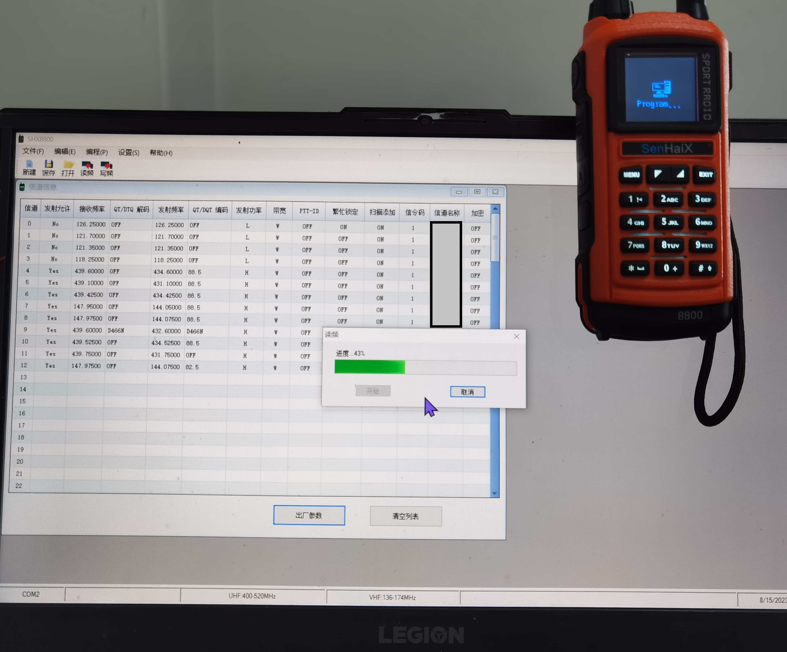
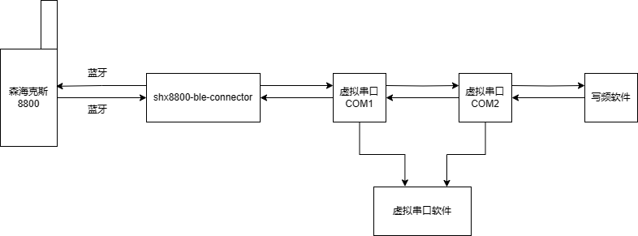
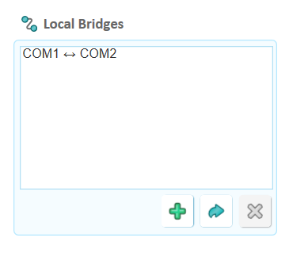
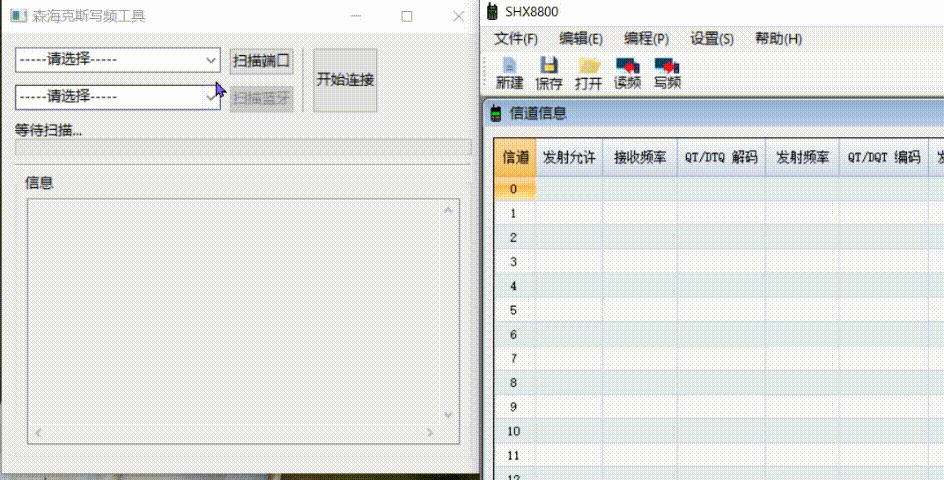

# README

## 简介

**注意：32位版本暂时无法使用，这是因为所用库对32位系统支持不完善造成的（[signal arrived during external code execution · Issue #189](https://github.com/tinygo-org/bluetooth/issues/189)）。请使用64位进行编译、使用**

该软件能在具有蓝牙能力的pc端上在没有写频线的情况下对森海克斯8800进行写频。

本质上该软件是一个中继器。由于windows无法直接为森海克斯8800蓝牙创建虚拟端口，该软件能做到连接森海克斯的蓝牙，在虚拟端口软件的支持下，与官方写频软件进行数据包的交换。（蓝牙写频协议和写频线串口写频协议应该是一致的，不确定，但是经测试可用）

## 使用方法

**警告：请在使用前做好备份工作（虽然理论上写频操作中途断开不会对设备造成影响）；绝对不要将此软件用于除读写频之外的功能（如系统升级）！对使用此软件产生的一切后果作者不负任何责任！**

### 前置工作

请下载任意虚拟端口软件（以HDD Virtual Serial Port Tools为例，可在releases中下载），创建两个互通的虚拟端口（以COM1/COM2为例）

### 手动编译

熟悉go的朋友们可以选择从源码编译。分为图形界面和命令行版本，编译指令见.github/workflows/build.bat

图形界面比较粗糙，可能有些bug，欢迎提出建议！

### 直接使用

[使用视频](https://www.bilibili.com/video/BV1fh4y1m7M8)

直接从releases下载对应版本的软件.双击运行即可

shx8800-ble-connector_windows_amd64.exe --------命令行版本gif演示：

shx8800-ble-connector-with-gui_windows_amd64.exe --------图形版本gif演示：

按照提示，将本软件连接到COM1端口，写频工具连接到COM2即可。

## 许可证

本软件采用Unlicense许可证
